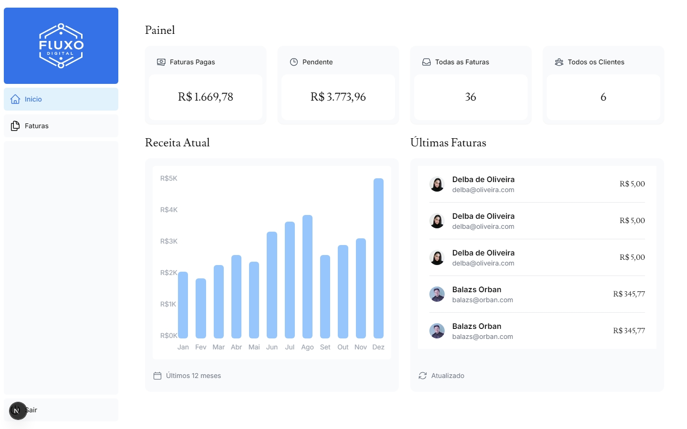

# Fluxo Digital

<div align="center">
  
</div>

## 📑 Índice

- [Sobre o Projeto](#-sobre-o-projeto)
- [Funcionalidades](#-funcionalidades)
- [Tecnologias Utilizadas](#-tecnologias-utilizadas)
- [Como Executar](#-como-executar)
- [Estrutura do Projeto](#-estrutura-do-projeto)
- [Licença](#-licença)

## 🚀 Sobre o Projeto

O Fluxo Digital é uma aplicação web moderna desenvolvida para gerenciar e otimizar o faturamento empresarial. Esta plataforma oferece uma solução completa para o acompanhamento financeiro, permitindo:

- Gerenciamento centralizado do faturamento por cliente
- Cálculos automáticos de balanços individuais e totais
- Interface intuitiva para visualização de dados financeiros
- Dashboard personalizado com métricas importantes
- Sistema de autenticação seguro para acesso aos dados

A aplicação foi desenvolvida com foco em usabilidade e performance, utilizando as mais modernas tecnologias do mercado para garantir uma experiência fluida e profissional.

## ⚡ Funcionalidades

- Cadastro de clientes e faturamento individuais
- Cálculo total do faturamento da empresa
- Dashboard interativo com visualização de dados
- Sistema de autenticação e controle de acesso
- Relatórios personalizados por cliente
- Interface responsiva para acesso em qualquer dispositivo

## 🛠️ Tecnologias Utilizadas

- NextJS
- Tailwind
- Typescript
- PostgreeSQL

## 📦 Como Executar

Clique no link 

## 📁 Estrutura do Projeto

```
fluxo-digital/
├── app/                    # Diretório principal da aplicação
│   ├── dashboard/         # Páginas do dashboard
│   ├── login/            # Sistema de autenticação
│   ├── ui/               # Componentes de interface
│   ├── lib/              # Utilitários e funções auxiliares
│   └── query/            # Queries e operações de dados
├── public/               # Arquivos estáticos
│   ├── hero-desktop.png
│   ├── hero-mobile.png
│   └── logo.png
├── .env                  # Variáveis de ambiente
├── .env.local           # Variáveis de ambiente locais
├── next.config.ts       # Configuração do Next.js
├── tailwind.config.ts   # Configuração do Tailwind
└── package.json         # Dependências e scripts
```

## 📝 Licença

MIT License

Copyright (c) 2024 Fluxo Digital

Permission is hereby granted, free of charge, to any person obtaining a copy
of this software and associated documentation files (the "Software"), to deal
in the Software without restriction, including without limitation the rights
to use, copy, modify, merge, publish, distribute, sublicense, and/or sell
copies of the Software, and to permit persons to whom the Software is
furnished to do so, subject to the following conditions:

The above copyright notice and this permission notice shall be included in all
copies or substantial portions of the Software.

THE SOFTWARE IS PROVIDED "AS IS", WITHOUT WARRANTY OF ANY KIND, EXPRESS OR
IMPLIED, INCLUDING BUT NOT LIMITED TO THE WARRANTIES OF MERCHANTABILITY,
FITNESS FOR A PARTICULAR PURPOSE AND NONINFRINGEMENT. IN NO EVENT SHALL THE
AUTHORS OR COPYRIGHT HOLDERS BE LIABLE FOR ANY CLAIM, DAMAGES OR OTHER
LIABILITY, WHETHER IN AN ACTION OF CONTRACT, TORT OR OTHERWISE, ARISING FROM,
OUT OF OR IN CONNECTION WITH THE SOFTWARE OR THE USE OR OTHER DEALINGS IN THE
SOFTWARE.
